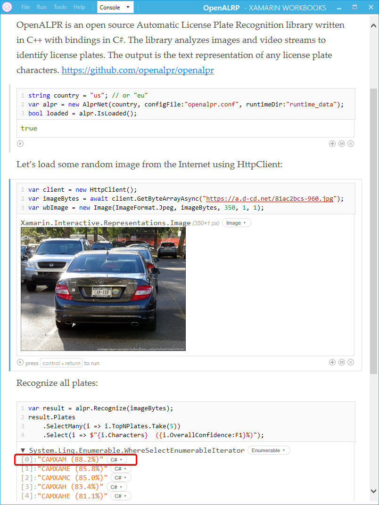

# OpenALRP Xamarin Workbook

OpenALPR is an open source Automatic License Plate Recognition library written in C++ with bindings in C#, Java, Node.js, Go, and Python. The library analyzes images and video streams to identify license plates. The output is the text representation of any license plate characters.

*Windows* only. For other platforms you will have to recompile the naitve lib

